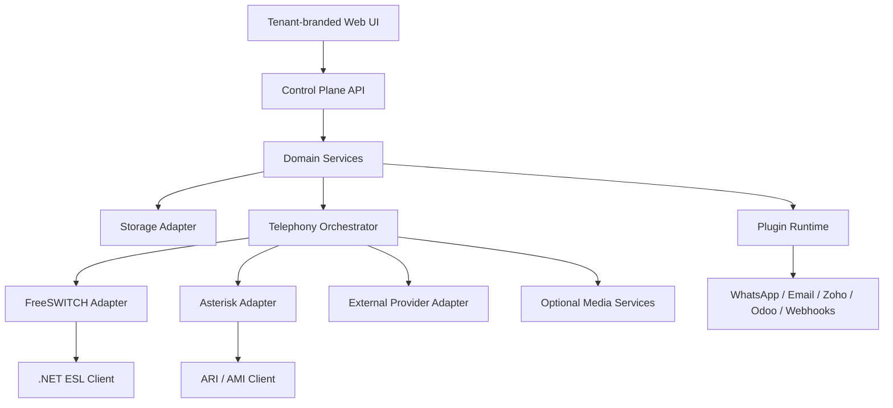

# ICPaaS — Versatile Deployment and Product Architecture

**Status:** Authoritative implementation blueprint  
**Repository:** `Mkali10/ICPaaS`  
**Principle:** One product, multiple deployment models, no hard-coded infrastructure dependency.

## 1. Product objective

ICPaaS is a multi-tenant inbound, outbound and blended communications platform. It must run in any of these forms without changing business logic:

1. **All-in-one:** application, bundled database, cache, PBX and optional media services on one server.
2. **Application-only:** ICPaaS uses an existing remote database and remote SIP/PBX server.
3. **Telephony-only node:** a remote FreeSWITCH or Asterisk node connects to the control plane through authenticated APIs and events.
4. **Distributed:** database, API, web UI, SIP edge, media nodes, workers and storage run on separate systems.
5. **Hybrid PBX:** FreeSWITCH and Asterisk operate simultaneously; routing is selected per tenant, campaign, DID or call.
6. **External provider:** calls use a CPaaS or carrier API without a locally managed PBX.
7. **Development/demo:** embedded storage and simulated telephony allow UI and workflow testing without a live SIP server.

“Portable” does not mean the platform has no software requirements. It means every infrastructure dependency is installable, replaceable, discoverable and isolated behind an adapter.

## 2. Non-negotiable rules

- Never hard-code a public IP address, domain, SIP host, database host or provider URL.
- Never expose credentials in source code, Git history, logs or frontend bundles.
- All service endpoints are configured during installation or through an authorized admin UI.
- Business modules never call FreeSWITCH, Asterisk, a database vendor or an integration vendor directly.
- All external systems are accessed through stable interfaces/adapters.
- Missing optional services must disable only their related capability, not crash the whole platform.
- Tenant data, branding, traffic, credentials and audit history remain isolated.
- A call must keep its selected engine for its full lifecycle, even when multiple PBX engines are active.
- Production actions must be auditable and idempotent.
- The product must expose readiness, dependency and capability status.

## 3. Logical architecture



## 4. Deployment profiles

### 4.1 Auto profile

The installer performs capability discovery and chooses the safest valid profile:

- If an external database is configured and reachable, use it.
- Otherwise install/start the bundled PostgreSQL service.
- If Redis is configured, use distributed cache and queue features.
- Otherwise use database-backed queues and local bounded cache.
- If FreeSWITCH is configured, enable its adapter.
- If Asterisk is configured, enable its adapter.
- If both are configured, enable hybrid routing.
- If neither is configured, enable simulator/API-only mode and clearly mark live SIP calling unavailable.
- If external object storage is configured, use it.
- Otherwise use encrypted local filesystem storage.
- If external TURN/media services are configured, use them.
- Otherwise allow the installer to start bundled CoTURN/RTPEngine.

### 4.2 Explicit profiles

| Profile | Database | Telephony | Intended use |
|---|---|---|---|
| `demo` | Embedded SQLite | Simulator | UI, training and workflow tests |
| `standalone` | Bundled PostgreSQL | Bundled or remote PBX | Single-server production |
| `application` | External DB | Remote PBX/API | Existing infrastructure |
| `telephony-node` | None locally | FreeSWITCH/Asterisk agent | Dedicated SIP/media server |
| `distributed` | External/clustered | Multiple nodes | Scale and HA |
| `hybrid` | Bundled or external | FreeSWITCH + Asterisk + providers | Mixed tenant workloads |

A production deployment must not silently fall back from PostgreSQL to SQLite. Embedded SQLite is limited to demo, development, recovery console and small offline utilities.

## 5. Configuration and service discovery

Configuration precedence:

1. Secure runtime secret provider
2. Environment variables
3. Mounted configuration file
4. Encrypted configuration stored by the platform
5. Installer-generated defaults for local-only services

Example endpoint model:

```text
DATABASE__MODE=auto|bundled|external|embedded
DATABASE__PROVIDER=postgresql|sqlite
DATABASE__HOST=<configured-at-install>
TELEPHONY__MODE=auto|freeswitch|asterisk|hybrid|external|simulator
FREESWITCH__ESL__HOST=<configured-at-install>
ASTERISK__ARI__BASE_URL=<configured-at-install>
MEDIA__MODE=auto|bundled|external|disabled
PUBLIC__API_BASE_URL=<tenant-or-deployment-specific>
PUBLIC__WSS_URL=<tenant-or-deployment-specific>
```

No example value may be treated as a production default. The installer must generate secrets and require the operator to confirm externally reachable endpoints.

## 6. Storage portability

Define application-level repositories:

- `ITenantRepository`
- `IIdentityRepository`
- `ICallRepository`
- `ICampaignRepository`
- `IQualityRepository`
- `IAuditRepository`
- `IPluginConfigurationRepository`
- `IOutboxRepository`
- `ILeaseRepository`

Supported modes:

### Embedded storage

- SQLite for demo/development and emergency administration.
- Automatic local file creation.
- No HA claims.
- Migration tool included.

### Bundled database

- Installer starts a PostgreSQL container/package.
- Creates database, role, schema and encryption material.
- Runs migrations and health checks.
- Backup/restore commands included.
- DB port need not be publicly exposed.

### External database

- Operator supplies connection details.
- Installer checks version, TLS, permissions, latency and migrations.
- Credentials stored through the secret provider.
- Connection pooling and retry policy enabled.
- No schema mutation occurs until validation succeeds.

The outbox/inbox pattern must be used for reliable events so distributed calls and integrations survive process restarts.

## 7. Telephony abstraction

All engines implement a single contract:

```csharp
public interface ITelephonyEngine
{
    string EngineKey { get; }
    Task<EngineHealth> ProbeAsync(CancellationToken ct);
    Task<RegistrationResult> RegisterEndpointAsync(EndpointSpec endpoint, CancellationToken ct);
    Task<OriginateResult> OriginateAsync(CallRequest request, CancellationToken ct);
    Task AnswerAsync(CallRef call, CancellationToken ct);
    Task BridgeAsync(CallRef first, CallRef second, CancellationToken ct);
    Task TransferAsync(CallRef call, TransferRequest request, CancellationToken ct);
    Task HoldAsync(CallRef call, bool enabled, CancellationToken ct);
    Task SendDtmfAsync(CallRef call, string digits, CancellationToken ct);
    Task HangupAsync(CallRef call, HangupReason reason, CancellationToken ct);
    IAsyncEnumerable<TelephonyEvent> SubscribeAsync(CancellationToken ct);
}
```

Domain code uses `ITelephonyEngine`; it must never depend directly on ESL, ARI or AMI.

### 7.1 FreeSWITCH adapter

- Persistent authenticated ESL connection.
- Separate command and event channels where appropriate.
- Automatic reconnect with bounded exponential backoff.
- Event subscription for create, originate, progress, answer, bridge, unbridge, transfer, recording and hangup.
- Event deduplication using engine UUID and sequence/time.
- API/bgapi command correlation.
- Dynamic directory, dialplan and gateway configuration through a protected provisioning API.
- Per-node capacity, CPS and channel reporting.
- Node draining without dropping existing calls.

### 7.2 Asterisk adapter

- ARI for call control and Stasis events.
- AMI for operational/queue/endpoint events that are not suitable for ARI.
- PJSIP provisioning through templates, realtime configuration or an authorized node agent.
- Same normalized call/event contract as FreeSWITCH.
- Engine-specific channel IDs remain internal to the adapter.

### 7.3 Hybrid operation

FreeSWITCH and Asterisk may run together.

Routing priority:

1. Explicit call override
2. DID binding
3. Campaign setting
4. Tenant policy
5. Healthy least-cost/least-loaded eligible engine
6. Deployment default

Persist this binding:

```text
platform_call_id
engine_type
engine_node_id
engine_call_id
selected_at
selection_reason
failover_group
```

An active call is never moved between engines. Failover applies to new call attempts or to a controlled retry before answer.

## 8. Node agent and distributed topology

Each SIP/media server runs a lightweight authenticated node agent. The control plane must not require direct shell access.

Node agent responsibilities:

- Register node and capabilities.
- Send heartbeat, version, channel count, CPS and resource metrics.
- Receive signed provisioning commands.
- Apply FreeSWITCH/Asterisk configuration atomically.
- Validate and reload configuration.
- Stream normalized events.
- Report command result and configuration revision.
- Support drain, maintenance and rollback.
- Never return raw secrets after storage.

Communication uses mutually authenticated TLS or short-lived signed node tokens. Every command includes tenant scope, idempotency key, expiry and audit identity.

## 9. WebRTC and media

WebRTC support includes:

- WSS SIP signaling.
- ICE/STUN/TURN discovery.
- DTLS-SRTP media.
- Temporary TURN credentials.
- NAT and symmetric NAT support.
- Remote audio attachment and autoplay recovery.
- Microphone permission/error states.
- Registration recovery and network-change handling.
- Mute, hold, DTMF, blind transfer, attended transfer and conference.
- Call quality statistics: RTT, jitter, packets lost, codec and audio level.

Media modes:

- **Direct:** browser and PBX exchange media when policy and network allow.
- **Anchored:** RTPEngine anchors/normalizes RTP.
- **TURN-assisted:** CoTURN relays WebRTC media when ICE requires it.
- **Provider:** external CPaaS owns media.
- **AI bridge:** selected audio is streamed to an AI/media service with consent and tenant policy.

Bundled CoTURN and RTPEngine are optional installation components, not mandatory application dependencies. Their adapters expose health and capability flags.

## 10. API-first boundaries

Use versioned APIs for:

- Authentication and tenant resolution
- Node registration and heartbeat
- Telephony commands and events
- DID and gateway provisioning
- Campaign execution
- Agent presence
- WebRTC credentials
- TURN credentials
- Recording metadata and controlled playback
- Quality evaluations
- Plugin installation/configuration
- Audit/export operations

Every write API must support an idempotency key where retries can cause duplicate business effects.

Internal APIs must not become public merely because services are distributed. Bind addresses, ingress, authentication and network policies are deployment configuration.

## 11. Tenant-aware UI

The UI must be a polished product, not a collection of CRUD forms.

Tenant branding tokens:

- Product name
- Logo and favicon
- Primary, secondary and accent colours
- Light/dark surface palette
- Font family
- Border radius and density
- Login illustration/background
- Email and notification identity
- Custom navigation visibility

UI principles:

- Responsive desktop-first agent workspace.
- Smooth, purposeful animations with reduced-motion support.
- Live call bar that remains visible across pages.
- Clear connection/media/registration states.
- Skeleton loading and recoverable error states.
- Keyboard-accessible controls.
- WCAG-oriented contrast, focus and semantics.
- Tenant branding changes previewed before publishing.
- No platform IP/domain shown to tenant users unless an admin explicitly exposes it.

Primary workspaces:

- Overview
- Agent Desk
- Campaigns
- Inbound/Queues
- Flow Builder
- DIDs and gateways
- Live calls
- Recordings
- Quality and compliance
- Reports and billing
- Integrations
- Team and permissions
- Tenant branding
- Platform/node operations for authorized admins

## 12. Plugin architecture

Plugin categories:

- Messaging: WhatsApp and future channels
- Email: SMTP and API providers
- CRM: Zoho, Salesforce and others
- ERP: Odoo and others
- Calendar and appointments
- Payments
- Webhooks
- Storage
- AI/STT/TTS
- Telephony providers

Plugin contract:

```csharp
public interface IIcpaasPlugin
{
    PluginManifest Manifest { get; }
    Task<PluginHealth> ProbeAsync(PluginContext context, CancellationToken ct);
    Task ValidateConfigurationAsync(JsonDocument configuration, CancellationToken ct);
    Task ExecuteAsync(PluginCommand command, PluginContext context, CancellationToken ct);
}
```

Requirements:

- Tenant-scoped installation and credentials.
- Admin approval for high-risk permissions.
- Encrypted secrets.
- Manifest-declared capabilities and webhook routes.
- Retry, rate limit, circuit breaker and dead-letter handling.
- Audit event for configuration and execution.
- Plugin failure cannot interrupt calling.
- Disable/uninstall preserves historical audit references.
- OAuth tokens refresh through backend workers, never the browser.

Initial plugins:

- WhatsApp Business/Cloud API adapter
- SMTP email adapter
- Zoho CRM adapter
- Odoo adapter
- Generic signed webhook adapter

## 13. Quality, audit and compliance workspace

A separate **Quality** workspace is required.

Modules:

1. **Evaluation forms**
   - Versioned scorecards
   - Weighted sections and critical-failure rules
   - Tenant/campaign/process-specific templates

2. **Evaluation queue**
   - Manual sampling
   - Random/percentage sampling
   - Agent/campaign/risk-based selection
   - Reviewer assignment and SLA

3. **Call review**
   - Permission-controlled recording playback
   - Transcript synchronized with timeline
   - Markers, notes and evidence
   - Disposition and script verification

4. **Agent coaching**
   - Score trends
   - Coaching tasks
   - Acknowledgement and re-evaluation
   - Dispute/appeal workflow

5. **Compliance**
   - Consent evidence
   - DNC/suppression proof
   - Calling-window policy result
   - Required disclosure/script checks
   - Recording policy
   - Retention/legal hold
   - Incident and corrective-action register

6. **Audit**
   - Immutable actor/action/resource/time/tenant record
   - Before/after metadata with secret redaction
   - Export with integrity hash
   - Administrative access history

AI-assisted scoring may recommend findings but cannot silently finalize regulated or punitive decisions. Human reviewer identity and final decision must be preserved.

## 14. Graceful degradation

| Missing/unhealthy dependency | Required behaviour |
|---|---|
| External DB unavailable during install | Offer bundled PostgreSQL |
| Production DB temporarily unavailable | Reject unsafe writes, buffer only bounded events, raise critical alert |
| Redis unavailable | Use DB queue/leases where supported; disable high-scale pacing |
| Object storage unavailable | Use encrypted local storage if policy allows |
| FreeSWITCH unavailable | Route eligible new calls to Asterisk/provider |
| Asterisk unavailable | Route eligible new calls to FreeSWITCH/provider |
| All telephony engines unavailable | Keep UI/admin available; block calling with clear reason |
| CoTURN unavailable | Attempt allowed ICE paths; show degraded WebRTC status |
| RTPEngine unavailable | Use permitted direct/provider media; block routes requiring anchoring |
| Plugin unavailable | Queue/retry plugin work; calling remains operational |
| AI unavailable | Continue human call flow or configured fallback |

No fallback may weaken tenant isolation, consent, authentication or encryption requirements.

## 15. Security model

- OIDC/JWT access with short-lived tokens.
- Refresh-token rotation and session revocation.
- MFA for privileged roles.
- RBAC plus tenant/resource policy checks.
- Database row isolation and application-level tenant guards.
- Secrets encrypted at rest and redacted from logs.
- Signed webhooks with replay protection.
- Node mTLS/short-lived credentials.
- SIP and API rate limiting.
- Destination allow/deny policy and fraud controls.
- Recording playback authorization and audit.
- Append-only security/audit events.
- Dependency and container scanning in CI.
- No “changing default ports” claim as a replacement for access control.

## 16. Reliability and observability

- Health endpoints: liveness, readiness and dependency/capability report.
- OpenTelemetry traces across API, command and event correlation IDs.
- Metrics for calls, CPS, channels, PDD, ASR, ACD, failures, jitter and packet loss.
- Structured logs with tenant-safe redaction.
- Distributed leases for workers.
- Transactional outbox and idempotent consumers.
- Retry budgets and circuit breakers.
- Node drain and maintenance mode.
- Database backup/restore validation.
- Configuration versioning and rollback.
- HA supported without requiring it for a standalone installation.

## 17. Installation experience

Provide one installer with interactive and non-interactive modes.

Suggested commands:

```bash
icpaas install --profile auto
icpaas doctor
icpaas configure database
icpaas configure telephony
icpaas node register
icpaas backup create
icpaas restore verify
icpaas upgrade check
```

Installer flow:

1. Detect OS/container runtime/resources.
2. Ask deployment profile.
3. Discover or configure database.
4. Generate/store secrets.
5. Configure one or more telephony engines.
6. Optionally install CoTURN/RTPEngine.
7. Configure storage and public endpoints.
8. Run migrations.
9. Create first platform administrator.
10. Run DB, API, PBX, WebRTC and plugin diagnostics.
11. Print a redacted installation report.

## 18. Repository structure

```text
ICPaaS/
├── src/
│   ├── ControlPlane.Api/
│   ├── Domain/
│   ├── Application/
│   ├── Infrastructure/
│   ├── Telephony.Abstractions/
│   ├── Telephony.FreeSwitch/
│   ├── Telephony.Asterisk/
│   ├── Telephony.External/
│   ├── NodeAgent/
│   ├── Plugin.Abstractions/
│   ├── Plugins.WhatsApp/
│   ├── Plugins.Email/
│   ├── Plugins.Zoho/
│   ├── Plugins.Odoo/
│   └── Workers/
├── web/
├── deploy/
│   ├── standalone/
│   ├── distributed/
│   ├── freeswitch/
│   ├── asterisk/
│   ├── coturn/
│   └── rtpengine/
├── tests/
│   ├── Unit/
│   ├── Integration/
│   ├── Contract/
│   ├── Sip/
│   └── WebRtc/
├── docs/
└── tools/installer/
```

Existing .NET/ESL code must be assessed and migrated into these boundaries; it must not be discarded solely to match this folder layout.

## 19. Delivery phases

### Phase 1 — Foundation

- Solution structure and domain contracts
- Configuration/capability discovery
- Embedded, bundled and external DB modes
- Authentication, tenancy and audit
- Base tenant-aware design system
- Health/doctor output

### Phase 2 — Telephony

- Persistent FreeSWITCH ESL adapter
- Asterisk ARI/AMI adapter
- Hybrid engine router
- DID/gateway/extension provisioning
- Normalized call lifecycle
- Node agent

### Phase 3 — WebRTC and operations

- Production browser softphone
- CoTURN/RTPEngine optional bundles
- Queues, campaigns, routing and live monitoring
- Recording and storage adapters
- Call-quality telemetry

### Phase 4 — Quality and plugins

- Quality/compliance workspace
- WhatsApp, email, Zoho, Odoo and webhook plugins
- Workflow actions and delivery workers
- Audit/export tooling

### Phase 5 — Production readiness

- Load, failover and recovery tests
- SIPp and browser WebRTC tests
- Backup/restore drill
- Security hardening
- Installation and operations manuals

## 20. Definition of done for live calling

Inbound and outbound calling is not considered complete until automated and manual tests prove:

- Browser registers through WSS.
- ICE succeeds on direct, NAT and TURN-required networks.
- DTLS-SRTP media is bidirectional.
- Inbound DID resolves tenant and flow.
- Agent receives, answers and ends the call.
- Outbound call uses authorized CLI and selected engine.
- FreeSWITCH and Asterisk each pass the same lifecycle contract tests.
- Hybrid selection and pre-answer failover work.
- Hold, DTMF, transfer and conference work.
- CDR, recording metadata, billing and audit events reconcile.
- Tenant isolation tests pass.
- PBX, DB, worker and plugin restarts do not create duplicate calls or events.
- Quality reviewers can securely review and score an authorized call.
- No real credential, infrastructure IP or private domain exists in source control.
